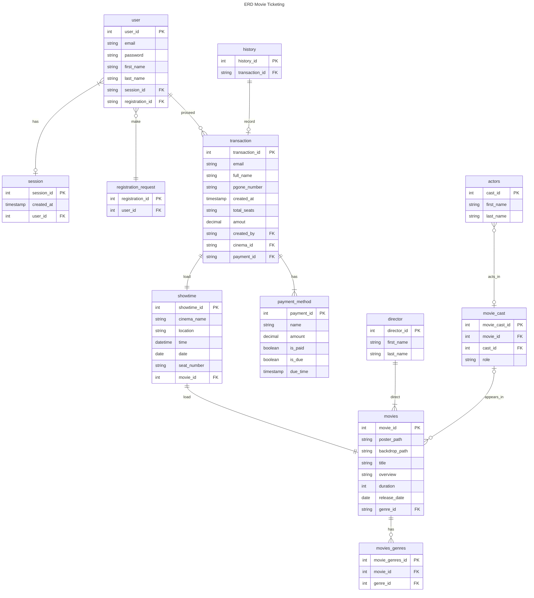

```mermaid

---
title: ERD Movie Ticketing
---
erDiagram
direction TB
    user }|--o|session : has
    user }o--||registration_request : make
    user ||--o{transaction : proceed
    showtime ||--||movies : load
    transaction ||--||showtime : load
    transaction ||--|{payment_method : has
    history ||--o|transaction : record
    movies ||--o{movies_genres : has
    director||--|{movies : direct
    actors }o--o|movie_cast : acts_in
    movie_cast|o--o{movies : appears_in

    user{
        int user_id PK
        string email
        string password
        string first_name
        string last_name
        string session_id FK
        string registration_id FK
    }

    session{
        int session_id PK
        timestamp created_at
        int user_id FK
    }

    registration_request{
        int registration_id PK
        int user_id FK
    }

    transaction{
        int transaction_id PK
        string email
        string full_name
        string pgone_number
        timestamp created_at
        string total_seats
        decimal amout
        string created_by FK
        string cinema_id FK
        string payment_id FK
    }

    showtime{
        int showtime_id PK
        string cinema_name
        string location
        datetime time
        date date
        string seat_number
        int movie_id FK
    }

    payment_method{
        int payment_id PK
        string name
        decimal amount
        boolean is_paid
        boolean is_due
        timestamp due_time
    }

    history{
        int history_id PK
        string transaction_id FK
    }

    movies{
        int movie_id PK
        string poster_path
        string backdrop_path
        string title
        string overview
        int duration
        date release_date
        string genre_id FK
    }

    movie_cast{
        int movie_cast_id PK
        int movie_id FK
        int cast_id FK
        string role
    }

    actors{
        int cast_id PK
        string first_name
        string last_name
    }

    movies_genres{
        int movie_genres_id PK
        int movie_id FK
        int genre_id FK
    }

    director{
        int director_id PK
        string first_name
        string last_name
    }

```