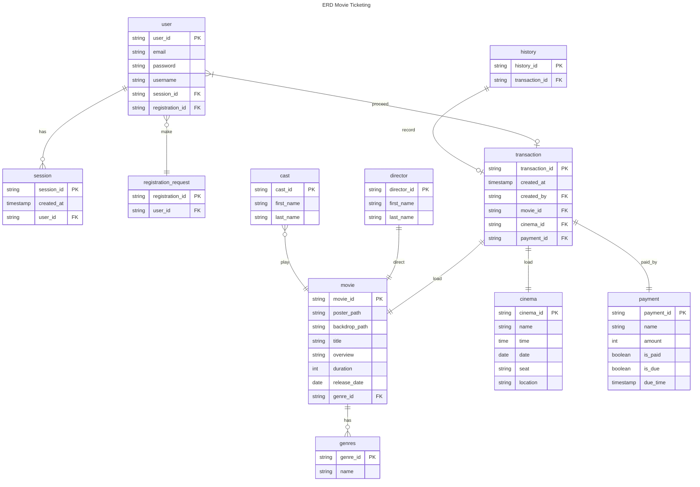

```mermaid

---
title: ERD Movie Ticketing
---
erDiagram
direction TB
    user ||--o{session : has
    user }o--||registration_request : make
    user }|--o|transaction : proceed
    transaction ||--||movie : load
    transaction ||--||cinema : load
    transaction ||--||payment : paid_by
    history ||--o|transaction : record
    movie ||--o{genres : has
    director||--||movie : direct
    cast }o--||movie : play

    user{
        string user_id PK
        string email
        string password
        string username
        string session_id FK
        string registration_id FK
    }

    session{
        string session_id PK
        timestamp created_at
        string user_id FK
    }

    registration_request{
        string registration_id PK
        string user_id FK
    }

    transaction{
        string transaction_id PK
        timestamp created_at
        string created_by FK
        string movie_id FK
        string cinema_id FK
        string payment_id FK
    }

    cinema{
        string cinema_id PK
        string name
        time time
        date date
        string seat
        string location
    }

    payment {
        string payment_id PK
        string name
        int amount
        boolean is_paid
        boolean is_due
        timestamp due_time
    }

    history{
        string history_id PK
        string transaction_id FK
    }

    movie{
        string movie_id PK
        string poster_path
        string backdrop_path
        string title
        string overview
        int duration
        date release_date
        string genre_id FK
    }

    genres {
        string genre_id PK
        string name
    }

    cast {
        string cast_id PK
        string first_name
        string last_name
    }

    director {
        string director_id PK
        string first_name
        string last_name
    }

```