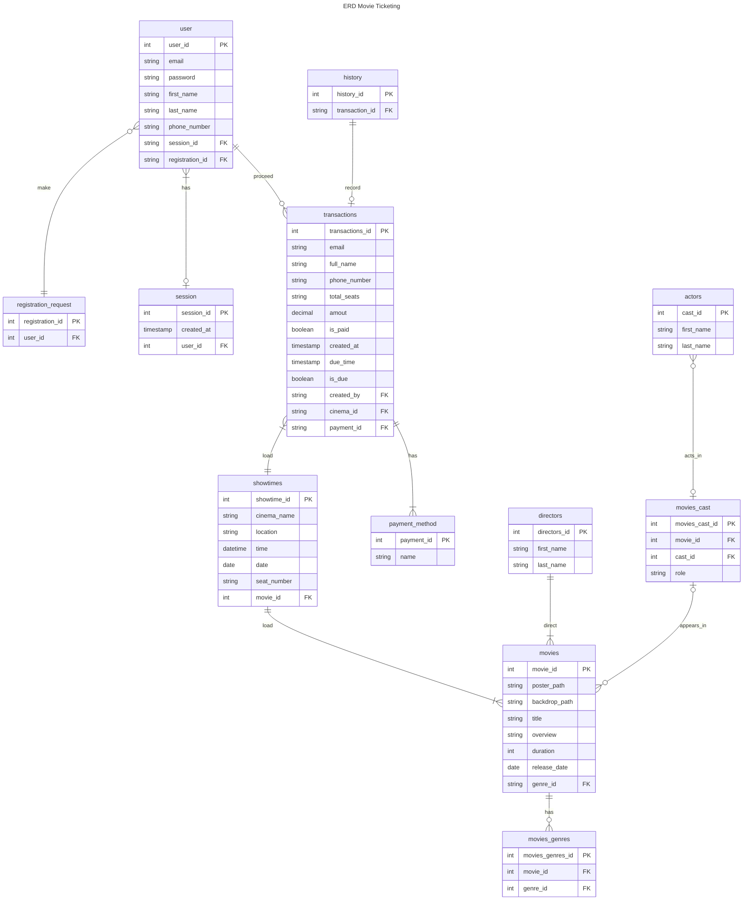

```mermaid

---
title: ERD Movie Ticketing
---
erDiagram
direction TB
    user }o--||registration_request : make
    user }|--o|session : has
    user ||--o{transactions : proceed

    showtimes ||--|{movies : load
    transactions }|--||showtimes : load
    transactions ||--|{payment_method : has
    history ||--o|transactions : record

    movies ||--o{movies_genres : has
    directors||--|{movies : direct
    actors }o--o|movies_cast : acts_in
    movies_cast|o--o{movies : appears_in

    user{
        int user_id PK
        string email
        string password
        string first_name
        string last_name
        string phone_number
        string session_id FK
        string registration_id FK
    }

    registration_request{
        int registration_id PK
        int user_id FK
    }

    session{
        int session_id PK
        timestamp created_at
        int user_id FK
    }

    transactions{
        int transactions_id PK
        string email
        string full_name
        string phone_number
        string total_seats
        decimal amout
        boolean is_paid
        timestamp created_at
        timestamp due_time
        boolean is_due
        string created_by FK
        string cinema_id FK
        string payment_id FK
    }

    showtimes{
        int showtime_id PK
        string cinema_name
        string location
        datetime time
        date date
        string seat_number
        int movie_id FK
    }

    payment_method{
        int payment_id PK
        string name
    }

    history{
        int history_id PK
        string transaction_id FK
    }

    movies{
        int movie_id PK
        string poster_path
        string backdrop_path
        string title
        string overview
        int duration
        date release_date
        string genre_id FK
    }

    movies_cast{
        int movies_cast_id PK
        int movie_id FK
        int cast_id FK
        string role
    }

    actors{
        int cast_id PK
        string first_name
        string last_name
    }

    movies_genres{
        int movies_genres_id PK
        int movie_id FK
        int genre_id FK
    }

    directors{
        int directors_id PK
        string first_name
        string last_name
    }

```